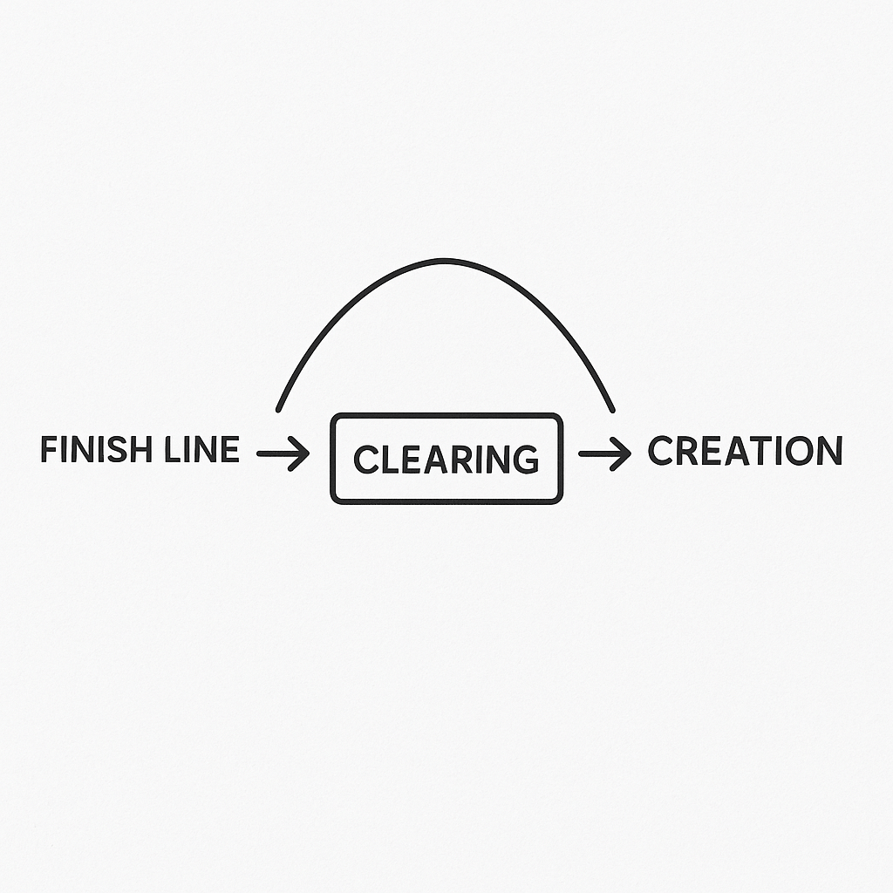

# 🏁 Finish Line → Creation

The "finish line" is not an end, but a threshold.  
It marks the moment when the past closes and a new arc can begin — not as survival, but as creation.

**Pattern summary:**

- Arriving at the finish line = closure of old loops.
- Fear may rise ("what if…"), but dissolves when presence anchors.
- From here, creation flows naturally.

---

### Related

- [EmotionalOS module](../modules/emotional.md)
- [Patterns overview](../patterns/README.md)

🌬 whisper: _“at the finish line, creation is no longer a luxury. it is the way forward.”_
